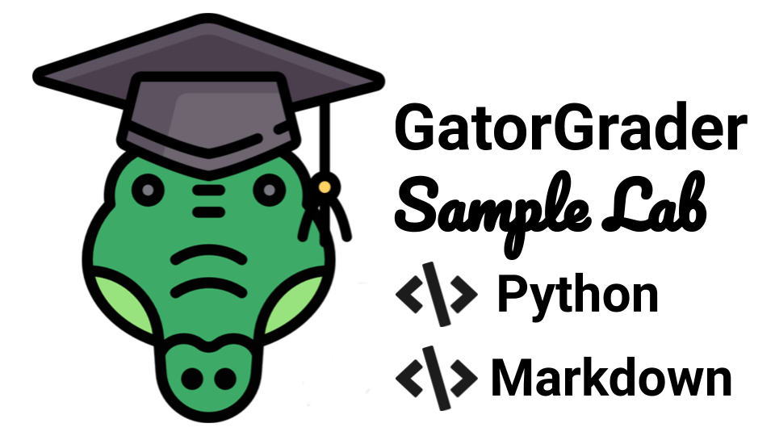

<!---

GatorGrader example that contains a solution to a Java programming project:
https://github.com/GatorEducator/python-assignment-solution-100-01

This is the companion "starter" repository (i.e., the repository given to students):
https://github.com/GatorEducator/python-assignment-starter-100-01

Learn more about GatorGrader and its supported checks by visiting this web site:
https://github.com/GatorEducator/gatorgrader

Problems? Raise an issue in the issue tracker for this assignment!

-->



<p align="center">
<b>
Automated assessment for an assignment on Python programming and technical writing in Markdown
</b>
</p>

# Python-assignment-solution-203-05

## Table of Contents

* [Table of Contents](#table-of-contents)
* [Introduction](#introduction)
* [Continuous Learning](#continuous-learning)
* [System Commands](#system-commands)
  + [Using Docker](#using-docker)
  + [Using Gradle](#using-gradle)
* [Expected Program Output](#expected-program-output)
* [Automated Checks with GatorGrader](#automated-checks-with-gatorgrader)
* [Downloading Project Updates](#downloading-project-updates)
* [Using Travis CI](#using-travis-ci)
* [System Requirements](#system-requirements)
* [Reporting Problems](#reporting-problems)
* [Receiving Assistance](#receiving-assistance)
* [Project Assessment](#project-assessment)

## Introduction

Designed for use with [GitHub Classroom](https://classroom.github.com/) and
[GatorGrader](https://github.com/GatorEducator/gatorgrader/), this repository
contains the starter for a laboratory assignment in an introductory computer
science class that uses the HTML and CSS programming language. The Travis CI builds
for this repository will pass, as evidenced of a red &#x2717; instead of a green
&#x2714;  appearing in the commit logs. An instructor would use this repository
to create a "starter" repository with purposefully omitted features that a
student would then need to add in order to achieve the stated learning
objectives. Please bear in mind that much of the content in this document is
written in its current form under the assumption that it will also accompany the
"starter" repository that an instructor shares with a student through the use of
[GitHub Classroom](https://classroom.github.com/).

This assignment requires a programmer to refactor, document, and automatically
test a Python program called `src/termfrequency/compute_tf_pipeline.py`. Please
refer to the Preface and Chapters 1 through 5 in "Exercises in Programming
Style" to learn more about this program's input, output, and behavior. You can
also review Chapters 1 through 3 in "Think Python" to learn more about how to
program in Python and run Python scripts. You also will refer to the first two
chapters in the "Pytest" book. In addition to the work that you did for the
previous practical assignment &mdash; exploring different command-line options
for Pytest, installing the `pytest-cov` code coverage calculation package,
perform code coverage analysis, and incrementally increasing the coverage of
your test suite &mdash; you will gain experience with refactoring Python
source code so that it meets well-established standards for source code
formatting.

When you use the `git commit` command to transfer your source code to your
GitHub repository, [Travis CI](https://travis-ci.com/) will initialize a build
of your assignment, checking to see if it meets all of the requirements. If both
your source code and writing meet all of the established requirements, then you
will see a green &#x2714; in the listing of commits in GitHub. If your
submission does not meet the requirements, a red &#x2717; will appear instead.
The instructor will reduce a programmer's grade for this assignment if the red
&#x2717; appears on the last commit in GitHub immediately before the
assignment's due date.

## Continuous Learning

If you have not done so already, please read all of the relevant [GitHub
Guides](https://guides.github.com/) that explain how to use many of the features
that GitHub provides. In particular, please make sure that you have read the
following GitHub guides: [Mastering
Markdown](https://guides.github.com/features/mastering-markdown/), [Hello
World](https://guides.github.com/activities/hello-world/), and [Documenting Your
Projects on GitHub](https://guides.github.com/features/wikis/). Each of these
guides will help you to understand how to use both [GitHub](http://github.com) and
[GitHub Classroom](https://classroom.github.com/).

To do well on this assignment, you should also read Chapters 1 and 3 in "Think
Python", paying particularly close attention to the content about variables,
expressions, statements, and functions. You should also read the Preface and
Chapters 1 through 5 in the "Exercises in Programming Style" book. Finally, you
should review the first two chapters in the "Pytest" book, focusing on the
content about parameterized unit testing. Please see the course instructor or
one of the teaching assistants or tutors if you have questions about any of
these reading assignments. Students who want to learn more about how to
calculate code coverage for a Pytest test suite are encouraged to read the
documentation for [Coverage.py](https://coverage.readthedocs.io/). Students are
also encouraged to search online for different Pytest plugins, specifically
learning more about `pytest-sugar`.

## System Commands

To get started in using the GatorGrader tool, you can change into the directory
for this assignment and type the command `gradle grade` in your terminal.
Running this command will produce a lot of output that you should carefully
inspect. If the output indicates that GatorGrader judges that there are no
mistakes in the assignment, then this means that your source code and writing
are passing all of the automated baseline checks. However, if the output
indicates that there are mistakes, then you will need to understand what they
are and then try to fix them.

This practical assignment also requires students to use
[Pipenv](https://github.com/pypa/pipenv) to create a virtual environment,
install and manage development packages, and to run Python commands. Here is a
sample of the Pipenv commands that you will need to run during this assignment.

- If needed, install and upgrade the `pipenv` command: `pip install pipenv --user`
- Install the development dependencies `pipenv` command: `pipenv install --dev`
- Reformat the program with `black`: `pipenv run black termfrequency/compute_tf_pipeline.py`
- Check the program with `pylint`: `pipenv run pylint termfrequency`
- Check the program with `flake8`: `pipenv run flake8 termfrequency`
- Run the program with `pipenv` and `python3` and a small input: `pipenv run python3 termfrequency/compute_tf_pipeline.py inputs/input.txt`
- Run the program with `pipenv` and `python3` and a realistic input: `pipenv run python3 termfrequency/compute_tf_pipeline.py inputs/pride-and-prejudice.txt`
- Run the test suite with `pytest`: `pipenv run pytest`
- Run the test suite with specialize coverage monitoring: `pipenv run pytest -x -s --cov-config pytest.cov --cov-report term-missing --cov`

To run one of these commands, you must be in the main directory for this
assignment where the configuration files are located. Then, you can type these
commands in the terminal and study the output.

### Using Docker

Once you have installed [Docker
Desktop](https://www.docker.com/products/docker-desktop), you can use the
following `docker run` command to start `gradle grade` as a containerized
application, using the [DockaGator](https://github.com/GatorEducator/dockagator)
Docker image available on
[DockerHub](https://cloud.docker.com/u/gatoreducator/repository/docker/gatoreducator/dockagator).

```bash
docker run --rm --name dockagator \
  -v "$(pwd)":/project \
  -v "$HOME/.dockagator":/root/.local/share \
  gatoreducator/dockagator
```

The aforementioned command will use `"$(pwd)"` (i.e., the current directory) as
the project directory and `"$HOME/.dockagator"` as the cached GatorGrader
directory. Please note that both of these directories must exist, although only
the project directory must contain something. Generally, the project directory
should contain the source code and technical writing of this assignment, as
provided to a student through GitHub. Additionally, the cache directory should
not contain anything other than directories and programs created by DockaGator,
thus ensuring that they are not otherwise overwritten during the completion of
the assignment. To ensure that the previous command will work correctly, you
should create the cache directory by running the command `mkdir
$HOME/.dockagator`. If the above `docker run` command does not work correctly on
the Windows operating system, you may need to instead run the following command
to work around limitations in the terminal window:

```bash
docker run --rm --name dockagator \
  -v "$(pwd):/project" \
  -v "$HOME/.dockagator:/root/.local/share" \
  gatoreducator/dockagator
```

Here are some additional commands that you may need to run when using Docker:

* `docker info`: display information about how Docker runs on your workstation
* `docker images`: show the Docker images installed on your workstation
* `docker container list`: list the active images running on your workstation
* `docker system prune`: remove many types of "dangling" components from your workstation
* `docker image prune`: remove all "dangling" docker images from your workstation
* `docker container prune`: remove all stopped docker containers from your workstation
* `docker rmi $(docker images -q) --force`: remove all docker images from your workstation

### Using Gradle

Since the above `docker run` command uses a Docker images that, by default, runs
`gradle grade` and then exits the Docker container, you may want to instead run
the following command so that you enter an "interactive terminal" that will
allow you to repeatedly run commands within the Docker container.

```bash
docker run -it --rm --name dockagator \
  -v "$(pwd)":/project \
  -v "$HOME/.dockagator":/root/.local/share \
  gatoreducator/dockagator /bin/bash
```

Once you have typed this command, you can use the [GatorGrader
tool](https://github.com/GatorEducator/gatorgrader) in the Docker container by
typing the command `gradle grade` in your terminal. Running this command will
produce a lot of output that you should carefully inspect. If GatorGrader's
output shows that there are no mistakes in the assignment, then your source code
and writing are passing all of the automated baseline checks. However, if the
output indicates that there are mistakes, then you will need to understand what
they are and then try to fix them.

## Expected Program Output

Running the program with the small input should produce the following output:

```
live  -  2
mostly  -  2
white  -  1
tigers  -  1
india  -  1
wild  -  1
lions  -  1
africa  -  1
```

Running the program with the realistic input should produce the following output:

```
mr  -  786
elizabeth  -  635
very  -  488
darcy  -  418
such  -  395
mrs  -  343
much  -  329
more  -  327
bennet  -  323
bingley  -  306
jane  -  295
miss  -  283
one  -  275
know  -  239
before  -  229
herself  -  227
though  -  226
well  -  224
never  -  220
sister  -  218
soon  -  216
think  -  211
now  -  209
time  -  203
good  -  201
```

To start, you should refactor the provided source code so that it adheres to all
of the well-established linting standards for Python source code. Following the
strategies that you developed in the previous assignments, you should add as
many test cases as you can to iteratively increase the coverage of the entire
test suite, aiming for at least 80% code coverage and the overall goal of nearly
100% code coverage. Make sure that you explore how to use parameterized tests in
Python and Pytest!

## Automated Checks with GatorGrader

In addition to meeting all of the requirements outlined in the assignment sheet,
your submission must pass the following checks that
[GatorGrader](https://github.com/GatorEducator/gatorgrader) automatically
assesses:

- The termfrequency/compute_tf_pipeline.py contains the import fragment `if __name__ ==`
- The termfrequency/compute_tf_pipeline.py runs correctly through `pipenv` without crashing or producing an error
- The termfrequency/compute_tf_pipeline.py produces exactly eight lines of output in the terminal when run with `inputs/input.txt`
- The termfrequency/compute_tf_pipeline.py does not contain any markers to indicate work that was not completed
- The tests/test_compute_tf_pipeline.py features the import statement `from termfrequency import compute_tf_pipeline`
- The tests/test_compute_tf_pipeline.py features at least five test cases that start with `test_`
- The tests/test_compute_tf_pipeline.py runs correctly through `pipenv` without crashing or failing a test
- The tests/test_compute_tf_pipeline.py does not contain any markers to indicate work that was not completed
- The writing/reflection.md passes the checks performed by the Markdown linting tool
- The writing/reflection.md passes the checks performed by the proselint linting tool
- The writing/reflection.md contains exactly five contiguous paragraphs of formatted text
- The writing/reflection.md each contiguous paragraphs of formatted text should include at least 100 words
- The writing/reflection.md contains a fenced code block with your final test coverage report
- The GitHub repository contains five commits beyond the repository's starting number of commits

## Updates

If the course instructor updates the provided material for this assignment and
you would like to receive these updates, then you can type this command in the
main directory for this assignment:

```
git remote add download git@github.com:Allegheny-Computer-Science-203-S2019/cs203-S2019-practical5-starter.git
```

You should only need to type this command once; typing the command additional
times may yield an error message but will not negatively influence the state of
your repository. Now, you are ready to download the updates provided by the
course instructor by typing:

```
git pull download master
```

This second command can be run whenever the course instructor needs to provide
you with new source code for this assignment. However, please note that, if you
have edited the files that the course instructor updated, running the previous
command may lead to Git merge conflicts. If this happens, you may need to
manually resolve them with the help of the instructor or a teaching assistant.

## Travis

This assignment uses [Travis CI](https://travis-ci.com/) to automatically run
the checking programs every time you commit to your GitHub repository. The
checking will start as soon as you have accepted the assignment, thus creating
your own private repository, and the course instructor enables Travis for it. If
you are using Travis for the first time, you will need to authorize Travis CI to
access the private repositories that you created on GitHub.

## System Requirements

We developed this assignment to work with the following software and versions:

- Docker Desktop
- Operating Systems
  - Linux
  - MacOS
  - Windows 10 Pro
  - Windows 10 Enterprise
- Programming Language Tools
  - Gradle 5.4
  - MDL 0.5.0
  - OpenJDK 11.0.4
  - Proselint 0.10.2
  - Python 3.6 or 3.7

## Reporting Problems

If you have found a problem with this assignment's provided source code or
documentation, then you can go to the [Java Assignment Solution
100-01](https://github.com/GatorEducator/java-assignment-solution-100-01)
repository and [raise an
issue](https://github.com/GatorEducator/java-assignment-solution-100-01/issues).
If you have found a problem with the [GatorGrader
tool](https://github.com/GatorEducator/gatorgrader) and the way that it checks
your assignment, then you can also [raise an
issue](https://github.com/GatorEducator/gatorgrader/issues) in that repository.
To ensure that your issue is properly resolved, please provide as many details
as is possible about the problem that you experienced. If you discover a problem
with the assignment sheet for this project, then please raise an issue in the
GitHub repository that provides the assignment sheets for your course.

Whenever possible, individuals who find, and use the appropriate GitHub issue
tracker to correctly document, a mistake in any aspect of this assignment will
receive free [GitHub stickers](https://octodex.github.com/) and extra credit
towards their grade for the project.

## Receiving Assistance

If you are having trouble completing any part of this project, then please talk
with either the course instructor or a student technical leader during the
course session. Alternatively, you may ask questions in the Slack workspace for
this course. Finally, you can schedule a meeting during the course instructor's
office hours.

## Project Assessment

Taking inspiration from the principles of [specification-based
grading](http://rtalbert.org/return-to-specs-grading-calculus/), the grade that
a student receives on this assignment will have the following components:

- **Percentage of Correct GatorGrader Checks**: Students are encouraged to
  repeatedly try to implement a Java program that passes all of GatorGrader's
  checks by, for instance, creating a program that produces the correct output.
  Students should also repeatedly revise their technical writing to ensure that
  it also passes all of GatorGrader's checks about, for instance, the length of
  its content and its appropriate use of Markdown.

- **Travis CI Build Status**: Since additional checks on the source code and/or
  technical writing may be encoded in Travis CI's actions and, moreover, all of
  the GatorGrader checks are also run in Travis CI, students will receive a
  checkmark grade if their last before-the-deadline build passes and a green
  &#x2714; appears in their GitHub commit log instead of a red &#x2717;. As with
  the previous grading component, students are encouraged to repeatedly revise
  their source code and technical writing in an attempt to get their Travis CI
  build to pass.

- **Mastery of Technical Writing**: Students will also receive a checkmark grade
  when the responses to the technical writing questions presented in the
  `writing/reflection.md` reveal a mastery of both writing skills and technical
  knowledge. To receive a checkmark grade, the submitted writing should have
  correct spelling, grammar, and punctuation in addition to following the rules
  of Markdown and providing technically accurate answers. Students are
  encouraged to ask the course instructor or a student technical leader to use
  the GitHub issue tracker to provide feedback on their mastery of technical
  writing skills.

- **Mastery of Technical Knowledge and Skills**: Students will receive also
  receive a checkmark grade when their GitHub repository reveals that they have
  mastered all of the technical knowledge and skills developed during the
  completion of this project. As a part of this grade, the instructor will
  assess aspects of the project including, but not limited to, the use of
  effective source code comments and Git commit messages. Students are
  encouraged to ask the course instructor or a student technical leader to use
  the GitHub issue tracker to provide feedback on how well their work
  demonstrates mastery of the assignment's technical knowledge and skills.

All grades for this project will be reported through a student's GitHub
repository using either messages in the GitHub commit log or issues raised in
the issue tracker. Students should ask questions about their grade for this
project in GitHub so as to facilitate an effective conversation about the
submitted deliverables.
